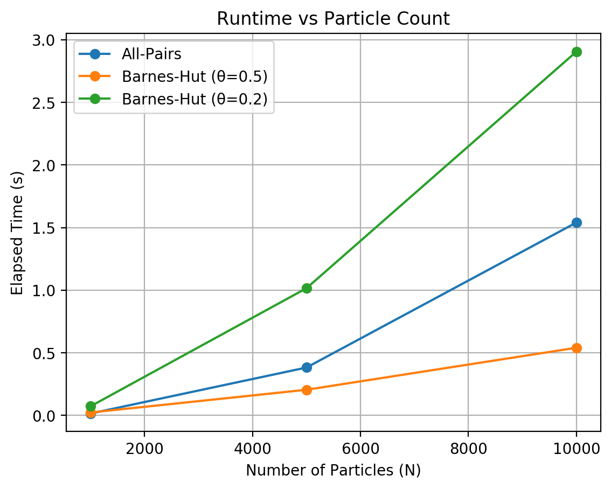
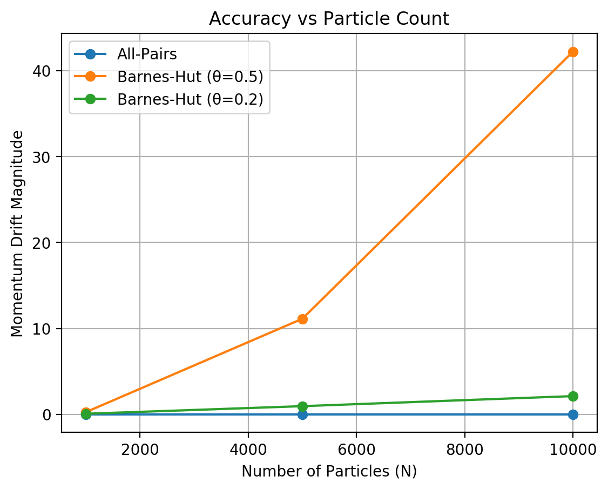
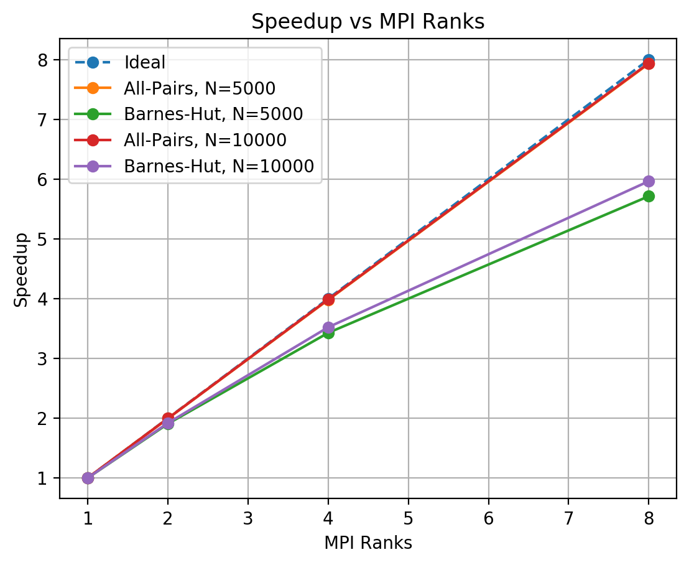

# Parallel Gravitational N-Body Simulation

A C++17/MPI simulation that compares direct all-pairs gravity with the Barnes-Hut approximation in three dimensions. The project was developed and benchmarked on the [Frontera supercomputer](https://www.tacc.utexas.edu/systems/frontera) to examine algorithmic complexity, numerical behavior, and strong scaling.

## What this project demonstrates

- Distributed particle updates with MPI collectives
- An `O(N^2)` direct-force reference implementation
- An approximately `O(N log N)` Barnes-Hut octree approximation
- Reproducible initial conditions and configurable runtime parameters
- Performance, speedup, parallel-efficiency, and momentum-drift analysis
- CMake builds, deterministic core tests, and automated MPI smoke tests

## Design

Each MPI rank owns a contiguous subset of particles. At every timestep, `MPI_Allgatherv` reconstructs a consistent global particle state; each rank then computes and updates only its local subset.

| Mode | Force calculation | Role |
|---|---|---|
| `allpairs` | Every particle interacts with every other particle | Accuracy and scaling baseline |
| `barneshut` | Distant octree nodes are replaced by aggregate mass | Runtime/accuracy tradeoff controlled by `theta` |

This replicated-data design was chosen for clarity and reproducibility. It is not intended to be the final architecture for very large systems: global particle exchange, independently rebuilt trees, and the absence of dynamic load balancing ultimately limit scalability.

## Build and test

Requirements:

- C++17 compiler
- CMake 3.16+
- MPI implementation such as Open MPI or MPICH
- Python 3 with Matplotlib for regenerating plots

On Ubuntu, the native dependencies can be installed with:

```bash
sudo apt-get install cmake g++ openmpi-bin libopenmpi-dev
```

Configure, build, and run the deterministic core tests:

```bash
cmake -S . -B build -DCMAKE_BUILD_TYPE=Release
cmake --build build --parallel
ctest --test-dir build --output-on-failure
```

GitHub Actions repeats the build and unit tests, runs both simulation modes across two MPI ranks, and checks the plotting scripts.

## Run the simulation

```text
./build/nbody [mode] [N] [steps] [dt] [theta] [snapshot_interval] [snapshot_prefix]
```

Arguments:

- `mode`: `allpairs` or `barneshut`
- `N`: number of particles
- `steps`: number of timesteps
- `dt`: timestep size
- `theta`: Barnes-Hut opening angle; smaller values traverse more of the tree
- `snapshot_interval`: interval between CSV snapshots; `0` disables snapshots
- `snapshot_prefix`: output filename prefix

Examples:

```bash
mpirun -np 4 ./build/nbody allpairs 10000 10 0.001
mpirun -np 4 ./build/nbody barneshut 10000 10 0.001 0.5
mpirun -np 2 ./build/nbody barneshut 200 20 0.001 0.5 5 demo
```

Runs emit a machine-readable `SUMMARY` line containing the mode, rank and particle counts, timing, mass change, and momentum-drift components.

## Results

The benchmark study used four MPI ranks for the size sweep. At `N = 10,000`, Barnes-Hut with `theta = 0.5` completed in 0.541 s versus 1.541 s for all-pairs, while introducing substantially greater momentum drift. Tightening `theta` to `0.2` reduced that drift but increased runtime to 2.906 s. These are measurements from the documented Frontera experiment, not general performance guarantees.





The strong-scaling runs showed near-ideal behavior for the regular all-pairs workload and lower efficiency for Barnes-Hut because of tree construction, irregular traversal, and replicated communication.



The full methods, experimental setup, raw result tables, limitations, and discussion are in the [project report](Parallel_Computing_Project.pdf).

The standalone repository includes the plotting scripts and final figures. Raw Frontera scheduler scripts and benchmark logs were not retained, so the report is the archival record of the measured results.

## Repository map

```text
src/            Simulation, octree, data distribution, and particle serialization
tests/          Deterministic unit tests for math, distribution, dynamics, and octree behavior
plots/          Benchmark figures and scripts used to generate them
CMakeLists.txt  Native build and test configuration
```

## Numerical and architectural limits

- The update is a simple semi-implicit Euler step; long-duration fidelity was not the study's objective.
- Every rank receives the global particle state at every step.
- Every rank independently constructs the Barnes-Hut tree.
- The implementation has no distributed tree or dynamic load balancing.
- Coincident particle positions are rejected because the single-particle octree leaves cannot separate them safely.
- Momentum drift is a useful comparison metric here, but it is not a complete measure of physical accuracy.
- The program is an educational HPC study, not a production astrophysics solver.

## Project history

This was an individual Spring 2026 parallel-computing project by Nicholas Babineaux at The University of Texas at Austin. The benchmark data in the report was collected on Frontera. The standalone portfolio version preserves the project history while adding automated tests, CI, and clearer reproduction guidance.
